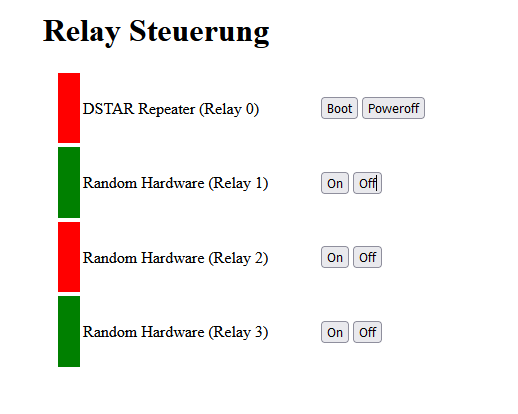

A little source code to control relays on a relay board using a raspberry pi via GPIO ports.

note: if you want to use other ports than GPIO.0 - GPIO.3, you will need to change the source file.
For the authentication, you will need to create a file called users.csv, which consists of username and hash separated by a ":" character.
To generate an argon2 hash, build the argon2 utility in the argon directory and then you can create the hash using `echo -n password | ./argon2 saltvalue`.
Please refer the argon2 documentation on how to create those hashes.

Since this does not aim to be a perfect solution, please be aware of hardcoded config properties and static html und not fully implemented features.

Download submodules

```bash
git submodules init
git submodules update
```

install requirements

```bash
apt install llvm clang make build-essential libsystemd-dev
```

Follow the build and install instructions of [WiringPi](https://github.com/WiringPi/WiringPi/)

make this project it
```bash
make
```

and install it
```bash
sudo make install
```

Open your browser and open the page http://raspberry-pi:8000/.

You should see a page that looks like this:

